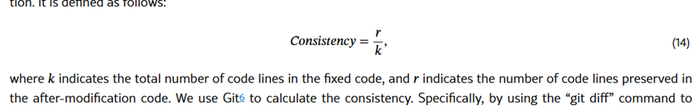

# AdaPatcher

#### 两个阶段：

* 代码定位:（通过⼀种 **⾃我调试学习**（self-debug learning）策略准确定位bug所在⾏。）
* 故障修改:（以定位的bug⾏为基础进⾏⼩范围修改。修改器训练时引⼊位置感知（location-aware）机制，只根据标记的bug⾏上下⽂⽣成补丁，混合训练策略强化对原代码的参考）

#### 代码修改的表示方法

* 假设有一个有错误的代码文件 c 和一个已修正的代码文件 y：
* 有错误的代码（c）：def add(a, b):
    				    return a - b
* 已修正的代码（y）：def add(a, b):
    					return a + b
* 生成的 diff 文件（d）：
                    def add(a, b):
                   -    return a - b
                   +    return a + b

#### 代码风格：

*     
    代码一致性指标：如上图，计算修改后保留的代码行数的比例。 定义如下
                        代码一致性 = r/k;
    k表示固定代码中的代码行总数，以及r表示修改后代码中保留的代码行数

#### 自适应偏好学习：
* 方法核心：通过对比两种代码修改程度的差异，利用偏好学习引导程序修改器学习更少修改的偏好。
* 偏好对：获取由程序修改器生成的偏好对（y+, y−），其中y+表示修改较少的正确版本代码，y−表示修改较多的不正确版本代码。
* 偏好集：构建包含这些偏好对的数据集，用于训练程序修改器。
* 具体实现：
    + DPO-Positive学习：基于偏好集应用DPO-Positive学习来增强程序修改器，通过迭代训练使其优先考虑需要较少修改的修复。
    + 损失函数：定义了修复损失函数，旨在最大化生成偏好代码的概率，从而实现有效修复且修改较少。
    + 在代码仓库中，Dpotrainer文件夹内是自适应偏好学习的算法，包括其损失函数。

#### 结论
* 通过AdaPatcher证明了故障报告（如错误消息）+ 精准定位可以让LLM⽣成让开发者更满意的补丁 
