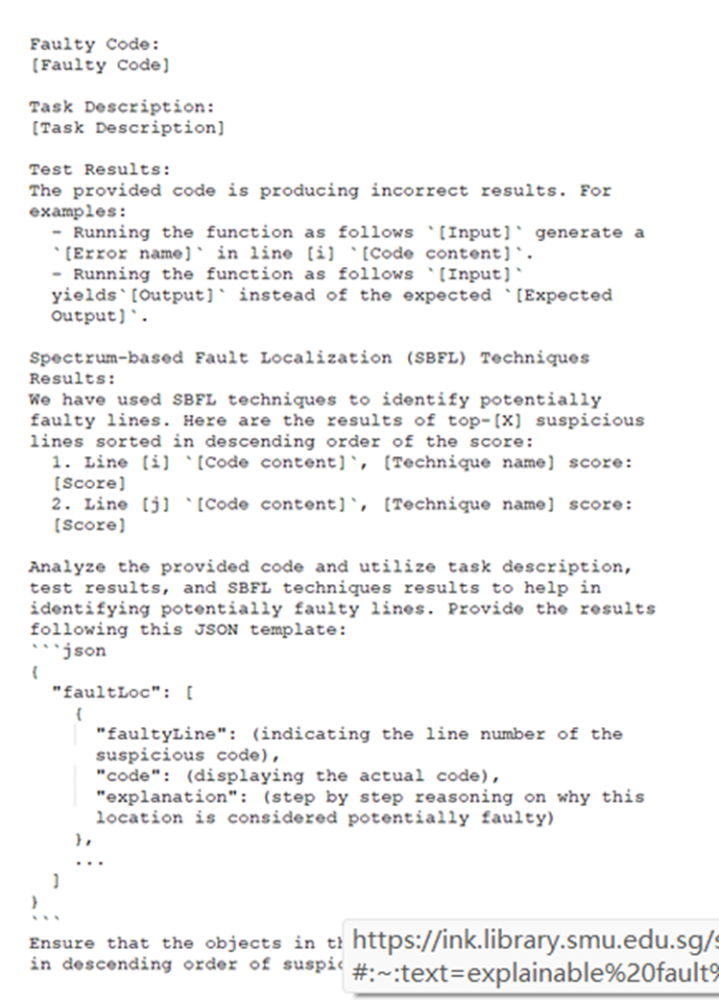

# FuseFL(代码没有开源)

#### 思路：

* 接入LLM对故障进行自然语言说明解释
   具体来说，就是生成 prompt 融合三类信息，让LLM进行链式思考，从而进行故障解释
* 构建数据集对比人类解释和大模型解释来观察实验效果

#### 三类信息是什么

1. SBFL结果：为了在测试用例执行期间获取覆盖率信息，使用了 Python 覆盖率库 [coverage · PyPI](https://pypi.org/project/coverage/)。
              应用基于频谱的故障定位 （SBFL） 技术来计算故障代码中每一行的可疑分数。
              这些行根据其可疑分数按降序排列。在提示中，使用前 5 条最可疑的线路作为主要信息。
2. 测试结果：提供有关测试结果的几条信息，包括输入值、预期和实际输出以及任何相关错误。
            输入和预期输出是从测试用例中的 “assert” 语句中提取的。
            例如， “assert” 语句：“assert remove_extras（[1， 1， 3]） == [1， 3]”。输入是 [1， 1， 3]，预期输出是 [1， 3]。
            为了获得实际输出，我们使用上述输入执行代码，然后解析结果输出。
            如果代码无法成功执行，我们会记录遇到的错误类型并指定发生错误的行。同时，如果代码运行没有问题，我们会记录实际输出。
3. 代码描述：代码描述概述了代码的要求，包括其预期功能、预期输入和预期输出。
            在这项研究中，我们利用了 Refactory 数据集中提供的代码描述。（https://github.com/githubhuyang/refactory）
            如果 FuseFL 用户缺少代码描述，使用以下提示使用 ChatGPT 生成代码描述：“提供以下代码的简短代码描述：⟨code⟩。提供的代码应通过以下测试用例：⟨test cases⟩”。

#### 生成提示的模版：

* 
* 提取文字如下：
Faulty Code: [ ]
Task Description: [ ] 
Test Results: The code is producing incorrect results. For example:
•	Running the function as follows [Input] generates an [Error name] in line [i] [Code content].
•	Running the function as follows [Input] yields [Output] instead of the expected [Expected Output]. Spectrum-based Fault Localization (SBFL) Techniques Results: We have used SBFL techniques to identify potentially faulty lines. Here are the results of top-[X] suspicious lines sorted in descending order of the score:
1.	Line [i] [Code content], [Technique name] score: [Score]
2.	Line [j] [Code content], [Technique name] score: [Score] Analyze the provided code, test results, and SBFL techniques results to help in identifying potentially faulty lines. Provide the results in JSON format following this template:
{
  "faultLoc": [
    {
      "faultyLine": [line number of the suspicious code],
      "code": [actual code],
      "explanation": [step-by-step reasoning on why this location is considered potentially faulty]
    },
    ...
  ]
}
* 这就是如何将三类信息加入prompt的模版。

翻译：
错误代码（Faulty Code）：[ ]
任务描述（Task Description）：[ ]
测试结果（Test Results）：该代码产生了错误的结果。例如：
以下列方式运行函数 [输入] 时，在第 [i] 行发生了 [错误名称]：[代码内容]；
以下列方式运行函数 [输入]，输出为 [输出结果]，但期望的结果是 [期望输出]。
基于频谱的故障定位（SBFL）技术结果：我们使用 SBFL 技术来识别潜在的故障代码行。以下是根据得分降序排序的前 [X] 条可疑代码行结果：
第 [i] 行：[代码内容]，[技术名称] 得分：[得分]
第 [j] 行：[代码内容]，[技术名称] 得分：[得分]
请分析提供的代码、测试结果以及 SBFL 技术的结果，以帮助识别潜在的故障代码行。
请使用以下模板，以 JSON 格式提供结果：
{
  "faultLoc": [
    {
      "faultyLine": [可疑代码的行号],
      "code": [该行实际代码],
      "explanation": [关于为什么该位置被认为是潜在错误的逐步推理说明]
    },
    ...
  ]
}

#### 实验：
* ⾸先⽐较FuseFL的⾃动故障定位性能，与不含这些附加信息的LLM定位结果作对⽐，以Top-1命中率衡量改进幅度。
* 其次，将FuseFL⽣成的解释与⼈类参考解释⽐对，并通过⼈⼯⽤户研究评估解释的正确性和有⽤性（随机抽样30个案例请开发者判断）。

#### 效果评估：
* 用这个数据集：（R. Widyasari, J. W. And, T. G. Nguyen, N. Sharma, and D. Lo, “Fusefl explainable fault localization.” [Online]. Available: https://figshare.com/s/bce02cb607a6c30043ad） 这个数据集包含了大模型解释和人类解释。
