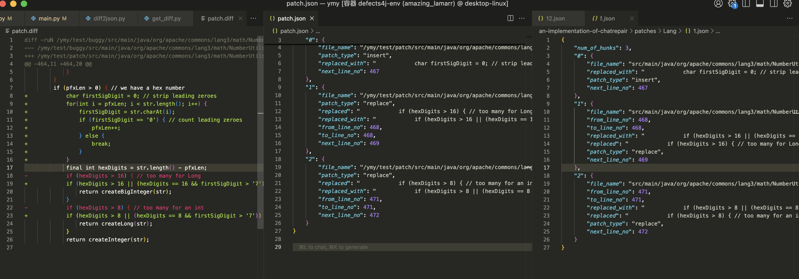
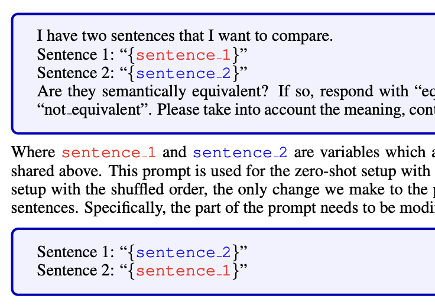
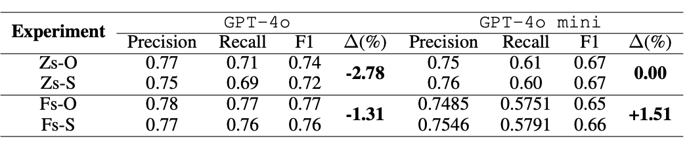
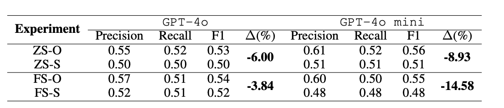

4.1前
元铭宇进度更新：
现在已经掌握了如何从defects4j中获取buggy代码和补丁，生成diff文件以及如何利用diff文件来生成prompt输入。
主要写了两个脚本：
[get_diff.py](ChatRepair/my_code/get_diff.py):方便执行命令的脚本，可以一键生成diff文件
[diff2json.py](ChatRepair/my_code/diff2json.py):将diff文件转化为json文件的脚本
经过比对，生成的json（即初始prompt）与ChatRepair项目中的相同。
如图：左边为diff文件，右边为ChatRepair项目中的json文件，中间为我的json文件


并且根据这个脚本，也可以把数据集不局限于defects4j，而是可以换成其他数据集。只需要有buggy代码和patch代码即可，同时支持批处理。


可用的函数：
```python
def save_initial(project, all_single_function_flag):
    # 获取项目目录下的所有文件
    files = os.listdir(os.path.join(PATCH_JSON_FOLDER, project))
    for file in files:
        initial_prompt = ''
        # 根据标志选择构建单函数或完整初始提示
        if all_single_function_flag == True:
            initial_prompt = construct_single_function_initial_prompt(project, file)
        else:
            initial_prompt = construct_initial_prompt(project, file)
        # 如果初始提示不为空，保存到文件
        if not initial_prompt == '':
            f = open_file(os.path.join(INITIAL_PROMPT_FOLDER, project, file.rstrip(".json") + ".txt"), 'w')
            f.write(initial_prompt)
    # 打印成功信息
    print("Success!\nInitial Prompt is saved in " + INITIAL_PROMPT_FOLDER + "/" + project + "!")
```
可以直接调用这个函数，来生成第一次输入给大模型的prompt。
而实现这一步也很简单，因为ChatRepair项目中可以利用命令行参数直接在这一步停下来
```bash
python main.py [first_argument] [second_argument] [third_argument]
```
只需要设置first_argument为initial-save即可。


---
[The Order Effect: Investigating Prompt Sensitivity in Closed-Source LLMs](https://arxiv.org/pdf/2502.04134)
这一篇主要是做了五个与输入顺序有关的实验，里面我觉得有价值的就只有前两个
1. MRPC实验：评估LLM判断两个句子是否是同义句的能力。任务的输入顺序是否被打乱影响LLM的判断结果。
   + 例：
   + 结果：
2. WebGPT实验：此实验评估模型在面对两个长答案时的比较能力。目标是检查模型是否能够在答案顺序改变时，依然保持一致性。
   +  顺序打乱设置： 将两个答案的顺序反转，看看模型是否依然能够选择正确的答案。即对照组为先输入答案一，再输入答案二；实验组为先输入答案二，再输入答案一。
   + 结果：

以上两个实验第二个的结果数据更好看的一些。而且第一个实验不太好套到我们的项目中。第二个实验的分析有提到“在几乎所有实验中，我们观察到输入长度与对顺序变化的脆弱性之间存在直接相关性：输入越长，模型在处理顺序变化时的性能波动越大”，并且将这个归咎于其LLM的“自回归性质”。


[顺序问题：探索多模态大型语言模型中的顺序敏感性](https://arxiv.org/html/2410.16983v1?utm_source=chatgpt.com)
+ 模型特别关注“开头”和“结尾”。这一点倒是可以做点文章，如果我们调整对应的顺序并且得到解释性比较强的东西，可以作为一个点来围绕大模型如何在输入上迭代以及给出结论我们在使用【某个模型】的时候，最好把【某个表现最优的信息】放在前面或者后面
+ 提到了一个PIA的指标——即模型在若干次输入（其实是同一输入的变体）中成功反馈，不过这个指标我们大概率是用不上的...

好吧其实这两篇文章，其实根本点都建立在大模型的”迭代“的特征上，一个是输入长度与正确性的相关性；一个是 "开头结尾"的强记忆性


